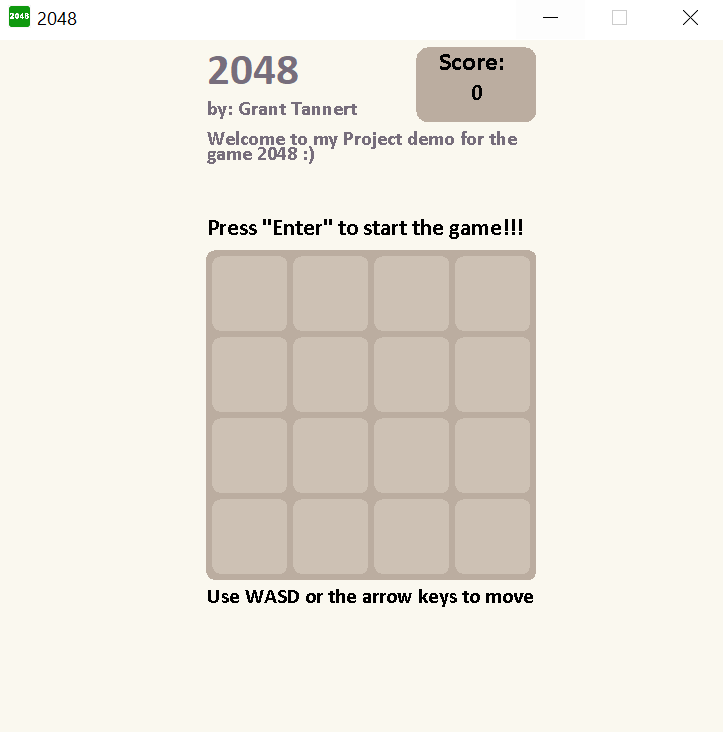

# 2048 Game



> Fun Adjustable 2048 game!!

---

### Table of Contents

- [Description](#description)
- [How to use](#how-to-use)
- [References](#references)
- [Author Info](author-info)

---

## Description

A similar version to the 2048 board game, but made where you are able to adjust the board size from 2 x 2 up to 5 x 5. Increase or decrease the difficulty by decreasing or increasing the board size (2 x 2 is Impossible). This is a beginner project for me in order for me to develop my programming skills.

### Technologies

- Java
- Javax Swing
- Markdown
- Visual Studio Code

[Back To The Top](#2048-game)

---

## How to use

#### Installation

> Download the source code and run it in your editor, terminal, IDE, etc..

#### API Reference

```Java
    import java.awt.event.*;
    import java.awt.*;
    import javax.swing.*;
```

[Back To The Top](#2048-game)

---

## References

- [2048](https://play2048.co/)
- [Program Your Own 2048 Game W/Java!](https://www.instructables.com/Program-Your-Own-2048-Game-WJava/)
- [Interesting Project Ideas Using ONLY Data Structures And Algorithms | DSA for Beginners](https://www.youtube.com/watch?v=9TJ2YgEaEBA)

[Back To The Top](#2048-game)

---

## Author Info
- [GitHub](https://github.com/Proguranto)
- [LinkedIn](https://www.linkedin.com/in/grant-tannert-7b3b6b1b9/)

[Back To The Top](#2048-game)